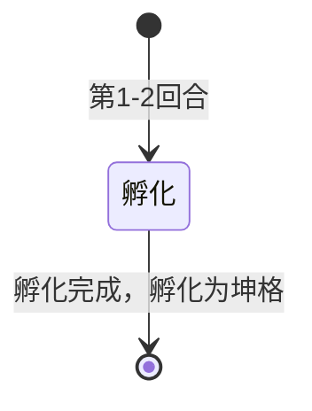

# 坤格的蛋

> **类型**：特殊怪物
> **初始生命**：63 - 68
> **遭遇战**：第一、二层普通战斗（与斯嘟尔同行）
> **特性**：孵化倒计时——2 回合后孵化为[坤格](/monsters/normal/kunge_monster)，蛋期间不攻击

## 被动能力（开局自带）

| 名称 | 类型 | 效果 |
|------|------|------|
| **孵化**（2 层） | Buff | 每回合结束时 -1 层，归零后孵化为一只[坤格](/monsters/normal/kunge_monster)，占据原槽位，原蛋死亡消失 |

::: tip 孵化机制
- 蛋加入房间时施加 2 层孵化
- 每回合蛋侧结束时孵化层数 -1
- 孵化层数归零时触发孵化：生成一只坤格加入同侧同槽位，再销毁蛋本身
- 孵化后的坤格继承蛋的槽位，不会错位
- 蛋期间每回合显示"孵化"意图，不攻击不防御，是空操作
:::

## 行动逻辑

坤格的蛋只有一个孵化状态，每回合执行空操作（孵化招式无效果），2 回合后孵化为坤格。

> **说明**：孵化期间空操作，不攻击不防御。

## 招式表

| 招式名 | 意图 | 类型 | 效果 |
|--------|------|------|------|
| **孵化** | 孵化 | 空操作 | 不做任何事，仅播放孵化动画。每回合使用一次，2 回合后孵化为坤格 |

## 遭遇战

| 遭遇战 | 池子 | 数量 | 说明 |
|--------|------|------|------|
| 弱怪池 | 弱怪池 | 2 只 | 与 1 只[斯嘟尔](/monsters/normal/siduer_monster)同行 |
| 强怪池 | 强怪池 | 4 只 | 与 1 只[斯嘟尔](/monsters/normal/siduer_monster)同行 |

## 策略提示

::: warning 2 回合硬性孵化时限
蛋在自身回合结束时（第 2 次行动后）孵化为[坤格](/monsters/normal/kunge_monster)。玩家只有 2 个回合的输出窗口。若 2 回合内未击杀蛋，它会孵化成 88~93 血的坤格（威胁骤升：烧伤联动顽皮之火削 PP、神圣焰盾回血格挡）。
:::

1. **优先速杀蛋是推荐策略，但不是唯一选择**：蛋血量仅 63~68，一回合即可击杀。优先在孵化前清光所有蛋，避免面对孵化后的坤格（88~93 血 + 烧伤联动顽皮之火削 PP + 神圣焰盾回血 8 + 格挡 8 的复合机制）。蛋孵化后坤格从三招随机开始行动（红焰爆破 8 伤 + 2 烧伤 / 顽皮之火削 PP / 神圣焰盾），威胁远高于空操作的蛋。若牌组爆发不足无法 2 回合清光所有蛋，可考虑让部分蛋孵化后用硬解处理坤格，但需承担烧伤/PP 削减的连锁压力。

2. **蛋期间是免费输出窗口**：蛋只有一个空操作的「孵化」招式，每回合显示孵化意图，不攻击不防御不格挡。这 2 回合是零压力的输出时间，应集中火力逐只击杀蛋。

3. **孵化时机的精确机制**：

   | 回合 | 玩家阶段 | 蛋阶段 | 回合末孵化层数 |
   |------|----------|--------|----------------|
   | 第 1 回合 | 玩家可攻击蛋（63~68 血） | 蛋执行空操作 | 2 → 1 |
   | 第 2 回合 | 玩家可攻击蛋（如未杀） | 蛋执行空操作 | 1 → 0 → **孵化！** |
   | 第 3 回合 | 面对孵化后的坤格 | 坤格从三招随机开始 | — |

   孵化机制：孵化能力（原版增益，计数器堆叠）在蛋自身回合结束时 -1 层。归零后触发孵化事件 → 生成一只坤格加入同侧同槽位 → 销毁蛋本身。新坤格继承槽位，不会错位。

4. **群体孵化威胁极高**：强怪池 4 只蛋 + 1 只斯嘟尔同场。若 2 回合内未击杀任何蛋，2 回合末同时孵化出 4 只坤格 + 1 只斯嘟尔，威胁直接失控（4 只坤格每回合可能造成 4×8=32 点红焰爆破伤害 + 8 层烧伤 + PP 削减）。强烈建议携带群体伤害牌或在遭遇战前确保输出充足。

5. **优先击杀蛋，而非斯嘟尔**：遭遇战中蛋（63~68 血）+ 斯嘟尔（84~89 血）同场。斯嘟尔有蜡烛光环吞 PP 牌 + 烛火之殇全场烧伤 + 蜡烛护盾滑溜+护盾，但**蛋的孵化威胁更紧迫**。斯嘟尔第一回合使用蜡烛护盾（自身 3 滑溜 + 3 护盾），不造成直接伤害；第二回合才使用烛火之殇（15 伤 + 3 烧伤）。应在 2 回合内优先击杀蛋（血量低且孵化后威胁大），再处理斯嘟尔。

   ::: tip 烧伤不会加速击杀蛋
   斯嘟尔第 1 回合使用「蜡烛护盾」（不施加烧伤），第 2 回合才使用「烛火之殇」（对全场施加 3 层烧伤）。而[烧伤](/powers/burn_power.md)在**持有者回合开始时**结算伤害，即怪物侧回合开始时——此时斯嘟尔尚未行动，烧伤还未施加。蛋在第 2 回合末就孵化了，因此**蛋实际承受 0 点烧伤伤害**。不要指望烧伤帮你击杀蛋，必须靠自身输出。
   :::

6. **孵化后的坤格从全新状态开始**：孵化生成的坤格是全新创建的怪物模型，不继承蛋身上的任何能力（包括烧伤、减益等）。坤格从三招随机开始行动（红焰爆破/顽皮之火/神圣焰盾等概率 1:1:1），不会因为蛋存活了 2 回合就跳过早期阶段。蛋的销毁是非致死性的，不会触发亡语。

7. **遭遇战分布**：

   | 遭遇战 | 池子 | 蛋数量 | 斯嘟尔数量 | 说明 |
   |--------|------|--------|------------|------|
   | 弱怪池 | 弱怪池 | 2 只 | 1 只 | 第一层普通战斗 |
   | 强怪池 | 强怪池 | 4 只 | 1 只 | 第二层普通战斗 |

   第三层强怪池使用另一种遭遇战（安妮 + 2 坤格直接登场，无蛋），不在本页讨论范围。

8. **蛋不进入图鉴招式**：蛋在图鉴中不展示任何招式条目（因为孵化是空操作）。图鉴仅展示受击和死亡动画。蛋的视觉借用原版 `tough_egg` 资源（由框架自动处理路径覆盖）。

## 源码

- 怪物：`SeerKungeEgg.cs`
- 孵化能力：`HatchPower.cs`（原版）
- 孵化意图：`SeerKungeIntents.cs`
- 遭遇战：`SeerKungeWeakEncounter.cs`、`SeerKungeStrongEncounter.cs`
- 本地化：`monsters.json`（`SEER_MONSTER_SEER_KUNGE_EGG.name`）、`intents.json`（`SEER_HATCH.*`）、`powers.json`（`HATCH_POWER.*`）
