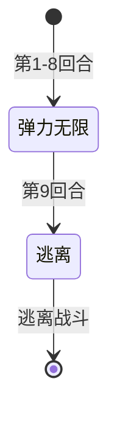

# 试炼史莱姆

## 基本信息

| 属性 | 数值 |
|---|---|
| 分类 | [特殊怪物](/monsters/special/) |
| 生命值 | 114514 - 114514 |
| 被动能力 | [消亡](#被动能力)（开局施加给玩家 9 层） |

## 行动逻辑

前 8 回合每回合使用「弹力无限」（变牌），第 9 回合执行「逃离」离开战斗。

> **说明**：弹力无限连续使用 8 回合后逃离，无奖励。

## 招式

| 招式 | 意图 | 描述 | 数值 |
|---|---|---|---|
| 弹力无限 | 弹力无限 | 随机将你抽牌堆中2张牌变为黏液。 | 每回合变 2 张牌为黏液 |
| 逃离 | 逃离 | 8 回合变牌后，逃离战斗。 | 标记已逃离后逃离战斗 |

## 被动能力

### 消亡（开局施加）

登场时对所有可命中的对手施加 9 层[消亡]（原版 Debuff/Counter）。玩家每回合结束时受到 9 点不可格挡、非攻击伤害。

- **施加时机**：怪物加入房间时遍历所有对手，对每个可命中目标施加 9 层消亡。
- **不递减**：每回合结束时仅造成当前层数的伤害，不递减层数。每回合固定 9 点伤害，持续至战斗结束。
- **能力类型**：Debuff（Counter 堆叠）。

## 遭遇战

| 遭遇战 | 房间类型 | 池子 | 数量 | 说明 |
|---|---|---|---|---|
| `SeerEventTrialSlimeEncounter` | Monster | 事件遭遇战（非标准池） | 1 只 | 由 [梅赫维特](#特殊机制) 事件"试炼"选项触发，无金币/卡牌战斗奖励（遗物通过事件发放），房间类型为 Monster（非 Event，避免存档加载崩溃），具名位置 slime1 |

## 特殊机制

### 试炼结果

试炼史莱姆由梅赫维特事件的"试炼"选项触发，直接进入战斗（不退出事件），战斗后由事件判定结果：

| 结果 | 条件 | 后果 |
|---|---|---|
| 胜利 | 史莱姆被击杀（未逃离） | 获得梅赫维特遗物（SeerMehrwert） |
| 逃离 | 史莱姆第 9 回合逃离 | 无奖励，事件结束 |
| 战败 | 玩家死亡 | 回复 15 点生命，事件结束（不结束游戏） |

- **逃离标记**：逃离招式在执行逃离前在遭遇战对象上设置逃离标记，通过存档持久化，供事件恢复时读取判定。
- **战败恢复**：事件恢复时检测玩家血量，若死亡则治疗 15 点生命并显示战败页面，不会导致游戏结束。

## 策略提示

::: warning 114514 血近乎不可击杀
史莱姆血量高达 114514，正常手段完全无法在 8 回合内击杀。获得梅赫维特遗物的唯一途径是具备**极高爆发**（如多段固定伤害、斩杀线触发、毁灭关键词清场等特殊机制）在 8 回合内打满 114514 伤害，否则第 9 回合怪物必定逃离，事件无奖励结束。
:::

1. **消亡的持续不可格挡压力**：怪物登场时立即对所有对手施加 9 层[消亡](/powers/demise_power.md)（原版 Debuff，Counter 堆叠不递减）。玩家回合结束时结算 9 点不可格挡的非攻击伤害（即不受力量加成也不可被格挡）。9 层会一直保持，**每回合固定 9 点**，直至战斗结束。

   | 回合 | 消亡层数 | 本回合伤害 | 累计伤害 |
   |------|----------|------------|----------|
   | 第 1 回合（玩家回合结束） | 9 | 9 | 9 |
   | 第 2 回合 | 9 | 9 | 18 |
   | 第 4 回合 | 9 | 9 | 36 |
   | 第 6 回合 | 9 | 9 | 54 |
   | 第 8 回合 | 9 | 9 | 72 |
   | 第 9 回合（怪物逃离前） | 9 | 9 | 81 |

   ::: warning 实际是 9 次结算 = 81 点
   消亡在**玩家回合结束**时结算，而怪物第 9 回合才执行「逃离」。回合顺序为：玩家回合 → 玩家回合结束（消亡结算）→ 怪物回合（逃离）。因此第 9 回合玩家仍会先受到 9 点消亡伤害，然后怪物才逃离。全程共 9 次结算 = 81 点不可格挡伤害（不是 8 次 72 点）。进入战斗前需确保生命值 > 81 或携带足够回复手段。
   :::

2. **弹力无限持续污染抽牌堆**：每回合将**抽牌堆**中 2 张可变换卡牌随机变为**黏液**（Slimed，状态牌），使用框架同步随机源确保多人同步。8 回合共污染 16 张牌，长线作战时抽牌堆会被黏液严重稀释，关键卡牌抽取概率骤降。注意：只影响**抽牌堆**，手牌和弃牌堆中的卡牌不会被变换。

3. **8 回合硬性时限**：怪物前 8 回合固定使用「弹力无限」（8 个独立招式状态串联，非循环），第 9 回合执行「逃离」并设置逃离标记。一旦逃离，梅赫维特事件恢复时检测到该标记后判定为逃跑结局，**不发放任何遗物**。若未在 8 回合内击杀，事件直接结束。

4. **战败兜底不结束游戏**：若玩家在战斗中死亡，梅赫维特事件恢复时会检测到玩家死亡，回复 15 点生命并显示战败页面，事件结束但**不会导致游戏结束**。这意味着试炼是一个"零风险"事件——最坏结局只是没拿到遗物，不会让存档崩盘。

5. **三种结局判定**：

   | 结局 | 条件 | 后果 |
   |------|------|------|
   | 胜利 | 8 回合内击杀史莱姆（未逃离） | 获得[梅赫维特](/relics/legendary/mehrwert)遗物 |
   | 逃跑 | 第 9 回合史莱姆执行逃离 | 无奖励，事件结束 |
   | 战败 | 玩家死亡 | 回复 15 点生命，事件结束，不结束游戏 |

6. **遭遇战无常规奖励**：战斗本身不发放金币、卡牌或药水奖励。遗物仅通过事件恢复在胜利结局发放，与常规战斗奖励机制完全脱钩。房间类型为 Monster（非 Event），这是为了避免存档加载崩溃。

7. **无法通过格挡抵消消亡**：消亡造成的伤害是不可格挡的非攻击伤害，意味着：①不可被格挡（Block 无效）；②不受力量影响（Strength 无效）。唯一应对方式是**回复生命**或**在 8 回合内击杀怪物**。荆棘/反伤等机制也无法反弹消亡伤害（因为是非攻击伤害）。

8. **多人模式下的随机同步**：弹力无限使用框架同步随机源选取变换卡牌，确保多端随机一致。消亡层数在怪物登场时（加入房间后）对所有对手统一施加，多端同步一致。

## 源码

- 怪物：`SeerTrialSlimeMonster.cs`
- 消亡能力：`DemisePower.cs`
- 逃离意图：`EscapeIntent.cs`
- 弹力无限意图：`SeerSlimeIntents.cs`
- 遭遇战：`SeerEventTrialSlimeEncounter.cs`
- 触发事件：`SeerMehvet.cs`
- 本地化：`monsters.json`、`intents.json`、`powers.json`
